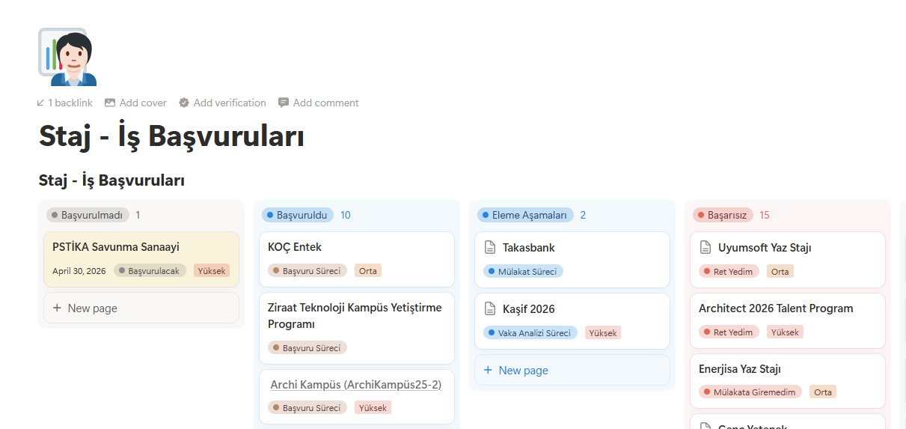

# 📅 Notion → Google Calendar Sync

> Notion'da takip ettiğim staj ve iş başvurularının tarihlerini Google Calendar'a otomatik yansıtan, saatte bir çalışan bir otomasyon.

---

## 💡 Neden Var?

Başvuruları Notion Kanban'da takip etmek çok iyi çalışıyor — ama son teslim tarihleri ve mülakat günleri gözden kaçabiliyor. Takvimi ayrıca güncellemek ise zahmetli.

Bu sistem ikisini birleştiriyor: **Notion'da rahatça takip et, tarihleri Google Calendar'da otomatik gör.**

---

## 🗂️ Notion Veritabanı



Her kart bir başvuruyu temsil eder. Sistem şu alanları okur:

- **Name** — başvurulan pozisyon / şirket
- **Date** — son başvuru veya mülakat tarihi
- **Status** — mevcut aşama (Başvurulmadı, Başvuruldu, Eleme Aşamaları…)

---

## ⚙️ Nasıl Çalışır?

```
Notion Kanban → sync.py → Google Calendar
                   ↑
        GitHub Actions (saatte bir)
```

| Notion'da ne olursa | Calendar'da ne olur |
|---|---|
| Tarihli yeni başvuru eklendi | Etkinlik oluşturulur |
| Başvuru adı veya durumu değişti | Etkinlik güncellenir |
| Tarih silindi veya kayıt kaldırıldı | Etkinlik silinir |

---

## 🔐 Kimlik Doğrulama

Expire olan OAuth token sorununu önlemek için **Google Service Account** kullanılır — bir kez kurulur, bir daha müdahale gerekmez.

| Secret | Açıklama |
|---|---|
| `NOTION_TOKEN` | Notion Integration token'ı |
| `GOOGLE_SERVICE_ACCOUNT_JSON` | Service account JSON anahtarı |

---

## 🛠️ Teknolojiler


